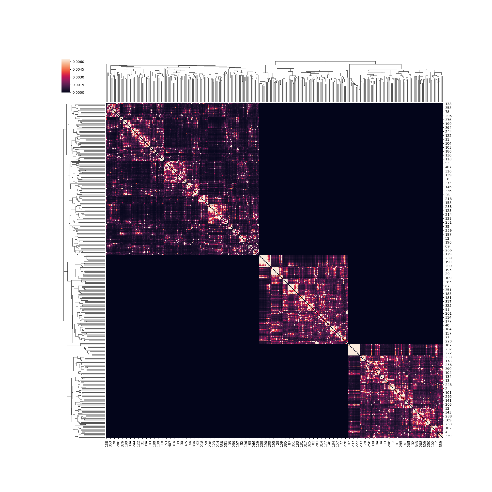
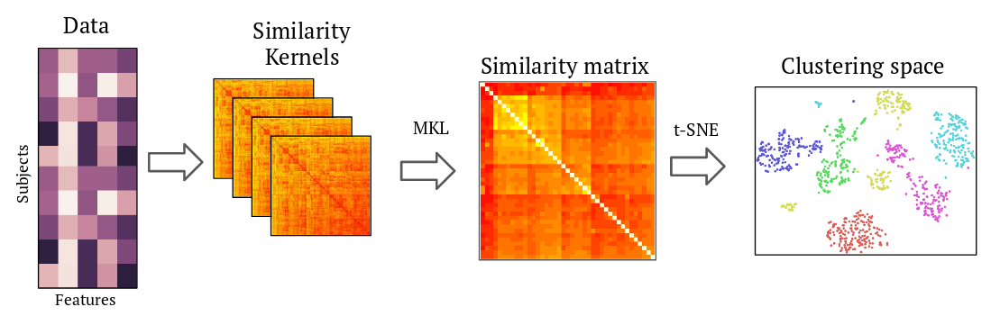

# SIMLR_AD - Cluster subtpying for Alzheimer's Disease.


dfadsfasdfafdafdfadf
Repository of the code implementing non-supervised clustering procedure [1]
for Alzheimer's disease patients subtyping. This is very interesting.



Very very interesting indeed.

All code under the GNU GPL license.

## Requeriments
Python 2.7+ is required.
Packages:

[Matlab engine for Python](https://es.mathworks.com/help/matlab/matlab-engine-for-python.html
) is also required:

## Folder description:
- **configs/** contains config files, needed for running the main script.
- **data/** contains the necessary data to run the script. It also contains dtic2018.csv is the list of patients used to reproduce the results presented at ETIC PhD Workshop 2018.
- **figures/** contains the necessary files to reproduce the figures of the poster presented at ETIC PhD Workshop 2018.
- **MATLAB/** contains the code for the SIMLR \[1\] procedure. Under the GNU GPL License.
- **utils/** contains code necessary for the correct functionality of the main script.
fdfdf
## Data
Data used is gathered from [ADNI](http://adni.loni.usc.edu/) database. Data is available [upon request](http://adni.loni.usc.edu/data-samples/access-data/). Due to the use agreement of ADNI, data cannot be redistributed. File named ```patients-dtic2018.csv``` contains a list of patients used in the results presented
at ETIC PhD Workshop 2018, for reproducibility.

Files needed for the experiment are:
- **UCSDVOL-1.csv** Downloaded from:
- **ADNIMERGE.csv** Downloaded from:
- **adni_plasma.csv** Downloaded from:
- **VITALS.csv** Downloaded from:

## Instructions:
1. Place the corresponding files in the data/ directory.

2. Run ```data/generate_cl_data.py``` to generate a file with the covariate data needed for the clustering. Script can be modified to include
   diferent covariates/patients.

3. Define a config file with the experiment parameters. An already existing file, named config_dtic2018.ini, was used
to generate the experiments presented at ETIC PhD Workshop 2018.

4. Execute simlr-ad.py. Example execution:
```
python simlr-ad.py --config_file configs/baseline_linux.ini --clusters 3 --output_directory_name test_poster
```
A new folder will be created, with the name you have chosen, in the root directory of the project.

### References
\[1\]: Wang, B., Zhu, J., Pierson, E., Ramazzotti, D., & Batzoglou, S. (2017). Visualization and analysis of single-cell rna-seq data by kernel-based similarity learning. Nature Methods, 14(4), 414–416. http://doi.org/10.1038/nMeth.4207
