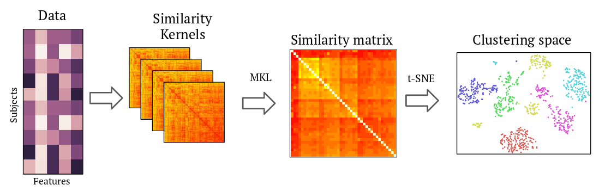

# SIMLR_AD - Cluster subtpying for Alzheimer's Disease.



Repository of the code implementing and applying a non-supervised clustering procedure \[1\]
for Alzheimer's disease patients subtyping.

## Introduction and motivation

Alzheimer's disease (AD) is a neurodegenerative pathology, which degenerates the brain and causes cognitive deterioration and loss of memory. It is one of the biggest problems in public health in the world, and while many efforts have been inverted into studying the disease, its causes and its progression, much things about the disease are still not known.

One interesting area to explore is disease subpying. Does the disease behaves differently between patients? If so, why? Answering those two questions mean:
1. Identifying possible subgroups of the population where the disease behaves similarly.
2. Identifying the factors that define those subgroups.

This project aims to solve those two questions. It tries to do this by clustering, using a non-supervised technique. over a space of non-typical AD covariates: data that is not used to diagnose the disease, but that can be obtained quite easily, such as plasma markers.

Detecting relevant subtypes of the disease could lead to a more personalized early treatment. Moreover, if the characteristics defining those subtypes are non-invasive markers, we could be closer to a non-invasive disease diagnostic test. This methodology could be applied to other problems and diseases.

This is a **work in progress**, so stay tuned!

All code under the [GNU GPL license](LICENSE).

## Requeriments
Python 2.7+ is required.
Packages:

[Matlab engine for Python](https://es.mathworks.com/help/matlab/matlab-engine-for-python.html
) is also required.

## Folder description:
- **configs/** contains config files, needed for running the main script.
- **data/** contains the necessary data to run the script.
- **poster/** contains the original poster file, as well as a script to generate the figures, and a file named **dtic2018_ptid.csv**, which is the list of patients used to reproduce the results in the poster presented at ETIC PhD Workshop 2018.
- **MATLAB/** contains the implementation of SIMLR \[1\]. Under the GNU GPL License.
- **utils/** contains extra code necessary for the correct functionality of the main script.

## Data
Data used is gathered from [ADNI](http://adni.loni.usc.edu/) database. Data is available [upon request](http://adni.loni.usc.edu/data-samples/access-data/). Due to the use agreement of ADNI, data cannot be redistributed. File named ```patients-dtic2018.csv``` contains a list of patients used in the results presented
at ETIC PhD Workshop 2018, for reproducibility.

Files needed for the experiment are as follows. The path indicated is respect to the ADNI website.
- **UCSDVOL.csv** Disponible in Download/Study Data/Imaging/MR Image Analysis/UCSD - Derived Volumes [ADNI1]
- **ADNIMERGE.csv** Disponible in Download/Study Data/Study Info/Data and Database/Key ADNI tables merged into one table
- **adni_plasma_qc_multiplex_11Nov2010.csv** Disponible in: Download/Study Data/Biospecimen/Biospecimen Results/Biomarkers Consortium Plasma Proteomics Project RBM Multiplex Data and Primer (Zip file)
- **VITALS.csv** Disponible in: Download/Study Data/Medical History/Physical/Neurological Exams/Vital Signs [ADNI1,GO,2,3]

## Instructions:
1. Place the corresponding files in the data/ directory.

2. Run ```data/generate_cl_data.py``` to generate a file with the covariate data needed for the clustering. Script can be modified to include
   diferent covariates/patients.

3. Define a config file with the experiment parameters. An already existing file, named **config_dtic2018.ini**, can be used to reproduce the results presented at ETIC PhD Workshop 2018.

4. Execute simlr-ad.py. Example execution:
```
python simlr-ad.py --config_file configs/config_dtic2018.ini --clusters 3 --output_directory_name test_poster
```
A new folder will be created in results/, with the name you have chosen, in the root directory of the project.

### References
\[1\]: Wang, B., Zhu, J., Pierson, E., Ramazzotti, D., & Batzoglou, S. (2017). Visualization and analysis of single-cell rna-seq data by kernel-based similarity learning. Nature Methods, 14(4), 414–416. http://doi.org/10.1038/nMeth.4207
