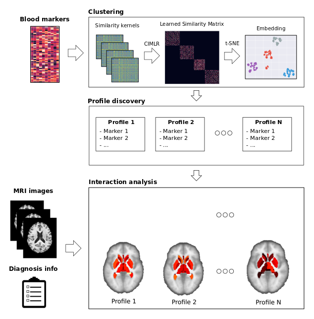

# CIMLR_AD - Cluster subtpying for Alzheimer's Disease.

Repository of the code implementing and applying a non-supervised clustering procedure \[1\]
for Alzheimer's disease patients profiling.

## Introduction and motivation

Alzheimer's disease (AD) is a neurodegenerative pathology, which degenerates the brain and causes cognitive deterioration and loss of memory. It is one of the largest problems in public health in the world, and while many efforts have been inverted into studying the disease, causes and progression paths, many things about the disease are still not known.

One interesting area to explore is disease subpying. Does the disease behave differently between patients? If so, why? Answering those two questions mean:
1. Identifying possible subgroups of the population where the disease interacts differently with the patient, provoking different symptoms.
2. Identifying the factors that define those subgroups.



This project tackles those two questions. We apply a non-supervised clustering technique \[1\] \[2\] over a space of blood markers, which are not typically used to detect the disease but are inexpensive and easy to obtain.

Detecting relevant subtypes of the disease could lead to a more personalized early treatment. Moreover, if the characteristics defining those subtypes are non-invasive markers, we could be closer to non-invasive testing. This methodology could be applied to other problems and diseases.

All code under the [GNU GPL license](LICENSE). SIMLR/CIMLR code forked from (https://github.com/BatzoglouLabSU/SIMLR)

## Requeriments
Python 2.7+ is required.
Packages:
 - pandas
 - numpy
 - scipy
 - sklearn
 - seaborn
 - matplotlib

[Matlab engine for Python](https://es.mathworks.com/help/matlab/matlab-engine-for-python.html) is also required, as well as having MATLAB installed.

[Freesurfer](https://surfer.nmr.mgh.harvard.edu/) is also required for the cortical experiments, and its [fsPalm extension](https://surfer.nmr.mgh.harvard.edu/fswiki/FsPalm).

## Folder description:
- **configs/** contains config files, needed for running the main script.
- **data/** contains the necessary data to run the script.
- **MATLAB/** contains the implementation of SIMLR \[1\]. Under the GNU GPL License.
- **utils/** contains extra code necessary for the correct functionality of the main script.
- **jupyter_experiments/** contains Jupyter notebooks useful to reproduce the experiments of the paper.
- **cortical_experiments/** contains Jupyter notebooks useful to reproduce the experiments of the paper on cortical analysis.

## Data
Data used is gathered from [ADNI](http://adni.loni.usc.edu/) database. Data is available [upon request](http://adni.loni.usc.edu/data-samples/access-data/). Due to the use agreement of ADNI, data cannot be redistributed, researchers have to ask for access to the data directly to ADNI. File named ```patients-dtic2018.csv``` contains a list of patients used in the results presented
at ETIC PhD Workshop 2018, for reproducibility.

Files needed for the experiment are as follows, all available in the ADNI website:
- **ADNIMERGE.csv**
- **adni_plasma_qc_multiplex_11Nov2010.csv**
- **ADMCDUKEP180UPLC_01_15_16.csv**
- **ADMCDUKEP180UPLC_DICT.csv**
- **ADNI_BLENNOWPLASMANFL.csv**
- **HCRES.csv**
- **UPENNPLASMA.csv**

## Instructions:
1. Place the corresponding files in the data/ directory.

2. Run ```data/Data_preparation.ipynb``` to generate a file with the covariate data needed for the clustering. Script can be modified to include
   diferent covariates/patients.

3. Define a config file with the experiment parameters.

4. Execute simlr-ad.py. Example execution:
```
python simlr-ad.py --config_file configs/config_dtic2018.ini --clusters 4 --output_directory_name test --cimlr
```
A new folder will be created in the folder defined in the configuration, with the name you have chosen, containing the results.

5. The statistical experiments can be done using the notebooks found in the folders **jupyter_experiments** and **cortical_experiments**.

### References
\[1\]: Wang, B., Zhu, J., Pierson, E., Ramazzotti, D., & Batzoglou, S. (2017). Visualization and analysis of single-cell rna-seq data by kernel-based similarity learning. Nature Methods, 14(4), 414–416. http://doi.org/10.1038/nMeth.4207
\[2\]: 1. Ramazzotti D, Lal A, Wang B, Batzoglou S, Sidow A. Multi-omic tumor data reveal diversity of molecular mechanisms underlying survival. bioRxiv. 2018:267245. doi:10.1101/267245
